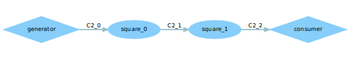
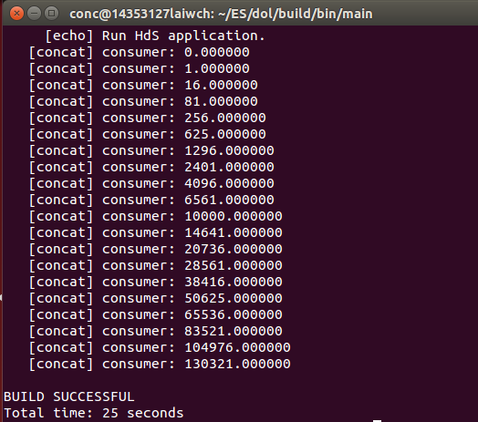
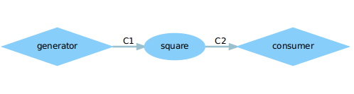
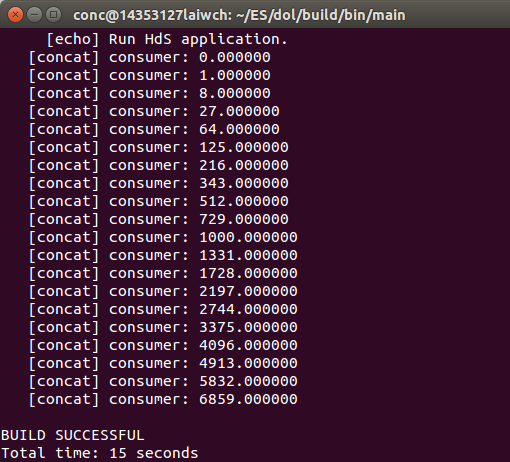

# DOL

### LAB3-DOL实例分析&编程

* 实验任务

1. 修改example2，让3个square模块变成两个，tips：修改xml的iterator

    

   各进程功能定义与example1相同，不同在于example2架构包含3个square进程，结果为i^6。实验任务就是将架构中3个square改成2个，得到i^4。

   ~~~xml
   <!--example2.xml-->
   <?xml version="1.0" encoding="UTF-8"?>
   <processnetwork xmlns="http://www.tik.ee.ethz.ch/~shapes/schema/PROCESSNETWORK" xmlns:xsi="http://www.w3.org/2001/XMLSchema-instance" xsi:schemaLocation="http://www.tik.ee.ethz.ch/~shapes/schema/PROCESSNETWORK
   http://www.tik.ee.ethz.ch/~shapes/schema/processnetwork.xsd" name="example2"> 

     <!--实验修改部分，将迭代次数改为2-->
     <!--variable value="3" name="N"/-->
     <variable value="2" name="N"/>

     <!-- instantiate resources -->
     <process name="generator">
       <port type="output" name="10"/>
       <source type="c" location="generator.c"/>
     </process>

     <iterator variable="i" range="N">
       <!--迭代定义N个square模块-->
       <process name="square">
         <append function="i"/>
         <port type="input" name="0"/>
         <port type="output" name="1"/>
         <source type="c" location="square.c"/>
       </process>
     </iterator>

     <process name="consumer">
       <port type="input" name="100"/>
       <source type="c" location="consumer.c"/>
     </process>

     <iterator variable="i" range="N + 1">
       <!--迭代连接N个square模块-->
       <sw_channel type="fifo" size="10" name="C2">
         <append function="i"/>
         <port type="input" name="0"/>
         <port type="output" name="1"/>
       </sw_channel>
     </iterator>

     <!-- instantiate connection -->
     <iterator variable="i" range="N">
       <connection name="to_square">
         <append function="i"/>
         <origin name="C2">
           <append function="i"/>
           <port name="1"/>
         </origin>
         <target name="square">
           <append function="i"/>
           <port name="0"/>
         </target>
       </connection>

       <connection name="from_square">
           <append function="i"/>
           <origin name="square">
             <append function="i"/>
             <port name="1"/>
           </origin>
           <target name="C2">
             <append function="i + 1"/>
             <port name="0"/>
           </target>
       </connection>
     </iterator>

     <connection name="g_">
       <origin name="generator">
        <port name="10"/>
       </origin>
       <target name="C2"> 
         <append function="0"/>
         <port name="0"/>
       </target>
     </connection>

     <connection name="_c">
       <origin name="C2">
         <append function="N"/>
         <port name="1"/>
       </origin>
       <target name="consumer">
         <port name="100"/>
       </target>
     </connection>

   </processnetwork>
   ~~~

    输出结果

    

2.  修改example1，使其输出3次方数，tips：修改square.c

     
     
     example中各文件的含义：

    * src文件夹: 各进程(生产者、消费者、处理模块等)的功能定义
    ~~~c
    //generator.c 定义进程： 产生0-19的整数(LENTH为20)
    #include <stdio.h>
    #include <string.h>

    #include "generator.h"

    void generator_init(DOLProcess *p) {
    //初始化函数：可选择写或不写，只会被执行一次
    	//p->local指向.h文件中_local_states结构
        p->local->index = 0; //当前位置为0
        p->local->len = LENGTH; //设置生产者长度
    }

    int generator_fire(DOLProcess *p) {
    //信号产生函数：每个模块都必须写上xxx_fire函数，可能会被执行无数次
        if (p->local->index < p->local->len) {
          //当前位置小于生产者长度，将当前下标写入输出端
            float x = (float)p->local->index;
            DOL_write((void*)PORT_OUT, &(x), sizeof(float), p);
            p->local->index++;
        }

        if (p->local->index >= p->local->len) {
          //当前位置大于等于生产者长度，销毁进程
            DOL_detach(p);
            return -1;
        }

        return 0;
    }
    ~~~
    ~~~c
    //consumer.c 定义消费者进程： 输出结果
    #include <stdio.h>

    #include "consumer.h"

    void consumer_init(DOLProcess *p) {
    //初始化函数
        sprintf(p->local->name, "consumer");
        p->local->index = 0;
        p->local->len = LENGTH;
    }

    int consumer_fire(DOLProcess *p) {
    //信号消费函数
        float c;
        if (p->local->index < p->local->len) {
          //当前位置小于设定长度，则读出输入端信号，并打印
            DOL_read((void*)PORT_IN, &c, sizeof(float), p);
            printf("%s: %f\n", p->local->name, c);
            p->local->index++;
        }

        if (p->local->index >= p->local->len) {
          //否则销毁进程
            DOL_detach(p);
            return -1;
        }

        return 0;
    }
    ~~~
    ~~~c
    //square.c 定义平方进程：现改成对输入进行立方操作
    #include <stdio.h>

    #include "square.h"

    void square_init(DOLProcess *p) {
        p->local->index = 0;
        p->local->len = LENGTH;
    }

    int square_fire(DOLProcess *p) {
      //信号处理函数，读入输入端信号i，将其平方后写出到输出端，重复length次之后就停止
        float i;

        if (p->local->index < p->local->len) {
            DOL_read((void*)PORT_IN, &i, sizeof(float), p);
            //i = i * i;
          	i = i*i*i; //实验修改部分：平方改成立方
            DOL_write((void*)PORT_OUT, &i, sizeof(float), p);
            p->local->index++;
        }

        if (p->local->index >= p->local->len) {
            DOL_detach(p);
            return -1;
        }

        return 0;
    }
    ~~~

    * example1.xml: 系统架构，即模块连接方式定义

    ~~~xml
    <?xml version="1.0" encoding="UTF-8"?>
    <processnetwork 
    xmlns="http://www.tik.ee.ethz.ch/~shapes/schema/PROCESSNETWORK" 
    xmlns:xsi="http://www.w3.org/2001/XMLSchema-instance" 
    xsi:schemaLocation="http://www.tik.ee.ethz.ch/~shapes/schema/PROCESSNETWORK
        http://www.tik.ee.ethz.ch/~shapes/schema/processnetwork.xsd" name="example1"> 

      <!-- processes -->
      <!--进程定义，端口的名字在对应的.h文件中-->
      <process name="generator"> <!--实现模块的名字-->
        <port type="output" name="1"/> <!--输出端口1-->
        <source type="c" location="generator.c"/>
      </process>

      <process name="consumer"> 
        <port type="input" name="1"/> 
        <source type="c" location="consumer.c"/>
      </process>

      <process name="square"> 
        <port type="input" name="1"/>
        <port type="output" name="2"/>
        <source type="c" location="square.c"/>
      </process>

      <!-- sw_channels -->
      <!--通道定义，一条线就是一条通道-->
      <sw_channel type="fifo" size="10" name="C1">
        <!--size是缓冲区的大小，name是线的名字-->
        <port type="input" name="0"/>
        <port type="output" name="1"/>
      </sw_channel>

      <sw_channel type="fifo" size="10" name="C2">
        <port type="input" name="0"/>
        <port type="output" name="1"/>
      </sw_channel>

      <!-- connections -->
      <!--定义各个模块之间的连接，每条线必须有两个connection-->
      <connection name="g-c">
        <!--从模块generator的1端口连到通道C1的0端口-->
        <origin name="generator">
          <port name="1"/>
        </origin>
        <target name="C1">
          <port name="0"/>
        </target>
      </connection>

      <connection name="c-c">
        <!--从通道C2的1端口连到模块consumer的1端口-->
        <origin name="C2">
          <port name="1"/>
        </origin>
        <target name="consumer">
          <port name="1"/>
        </target>
      </connection>

      <connection name="s-c">
        <!--从square的2端口连到通道C2的0端口-->
        <origin name="square">
          <port name="2"/>
        </origin>
        <target name="C2">
          <port name="0"/>
        </target>
      </connection>

      <connection name="c-s">
        <!--从通道C1的1端口连到模块square的1端口-->
        <origin name="C1">
          <port name="1"/>
        </origin>
        <target name="square">
          <port name="1"/>
        </target>
      </connection>

    </processnetwork>
    ~~~

    输出结果

     

* 实验感想

  ​        由于在配置的时候编译过example1，再次编译输出没有变化，可以去到build\bin\main文件夹下把对应的example1文件夹删除，再次编译即可。

  ​        通过本次实验，学会分析各个模块和系统架构的代码，对dol有一个初步的了解。

