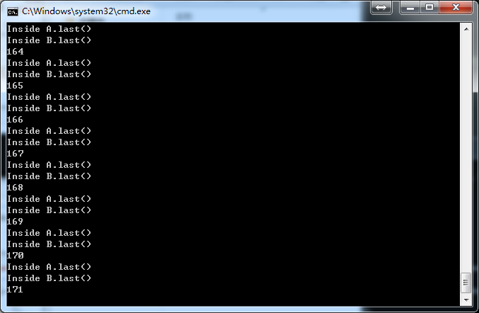

### LAB4-DEADLOCK

- 死锁的4个必要条件

  1. 互斥条件(Mutual exclusion)：一个资源每次只能被一个进程使用(资源互斥)
  2. 请求与保持条件(Hold and Wait)：一个进程因请求资源而阻塞时，对已获得资源保持不放(占有且等待)
  3. 不剥夺条件(No preemption)：进程已获得的资源，在未使用完之前不能强行剥夺(非抢占)
  4. 循环等待条件(Circular wait)：若干进程之间形成一种头尾相接的循环等待资源关系(循环等待)

- 实验流程及解释

  1. Deadlock.java代码

     ​	在声明A、B两个类的时候，使用关键字synchronized。它用来修饰一个方法或者一段代码块的时候，能够保证在同一时刻最多只有一个线程执行该段代码。当一个线程访问object的一个synchronized同步代码块或同步方法时，其他线程对object中所有其它synchronized同步代码块或同步方法的访问将被阻塞。

     ~~~java
     class A{
     	synchronized void methonA(B b){
           //进入该段代码时，对象b将被锁住
     		b.last();
     	}
     	synchronized void last(){
     		System.out.println("Inside A.last()");
     	}
     }

     class B{
     	synchronized void methodB(A a){
           //进入该段代码时，对象a将被锁住
     		a.last();
     	}
     	synchronized void last(){
     		System.out.println("Inside B.last()");
     	}
     }
     ~~~

     主函数

     ~~~java
     class Deadlock implements Runnable{
       A a = new A();
       B b = new B();

       Deadlock(){
         //构造函数
           Thread t = new Thread(this);
           int count = 20000;

           t.start();//线程t开始
           while(count --> 0);//等待count时长
           a.methonA(b);
       }

       public void run(){
         //runnable运行时调用的方法
           b.methodB(a);
       }
       public static void main(String args[]){
         //主函数
           new Deadlock();
       }
     }
     ~~~

     ​	简单来说，也就是主线程运行methodA，同时线程t运行methodB，相当于同时去请求一个锁，必须是同时，然后相互把对方锁住，也就产生了死锁。由于时间上有时有先后顺序，无法成环，所以每次运行死锁停下的位置可能不同，本次实验产生死锁在第171次。

  2. 编译

     ~~~
      javac Deadlock.java
     ~~~

  3. windows下.bat批处理文件，放在java程序同一目录下双击运行

     ~~~
       cd /d %~dp0
       @echo off
       :start
       set /a var+=1
       echo %var%
       java Deadlock
       if %var% leq 10000 GOTO start
       pause
     ~~~

  4. 调节count使其发生死锁。count的值是为了等待线程t的初始化完成，使得主线程和线程t能同时运行methodA和methodB。

- 实验结果(死锁截图)

  

  上图在第171次发生死锁，也就是在第171次，主线程和线程t同时运行methodA和methodB，使得对象a、b同时被锁住，无法执行a.last()和b.last()。

- 实验感想

  通过本次实验，熟悉java文件的编译，了解了死锁的条件及产生。

  ​