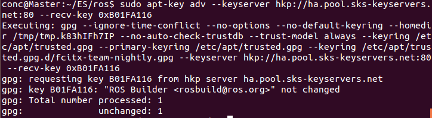

## LAB5-安装Cartographer ROS

### 在Ubuntu14.04中安装ROS Jade

*参考链接 http://wiki.ros.org/jade/Installation/Ubuntu*

0. ROS(Robot Operating System)是一个机器人软件平台，底层提供硬件驱动，软件层面支持通用的文件格式。实验主要使用它的仿真功能

1. 配置Ubuntu软件仓库

   配置Ubuntu软件仓库以允许"restricted"、"universe"和"multiverse"三种安装模式，具体操作如下图

    

2. 添加sources.list

   配置使其能安装来自packages.ros.org的软件包，在此使用国内镜像

   ```
   sudo sh -c '. /etc/lsb-release && echo "deb http://mirror.sysu.edu.cn/ros/ubuntu/ $DISTRIB_CODENAME main" > /etc/apt/sources.list.d/ros-latest.list'
   ```

3. 添加keys

   ```
   sudo apt-key adv --keyserver hkp://pool.sks-keyservers.net --recv-key 0xB01FA116
   ```

   

4. 安装

   首先，确保软件包索引最新

   ```
   sudo apt-get update
   ```

   安装以下工具修复依赖问题

   ```
   sudo apt-get install libgl1-mesa-dev-lts-utopic
   ```

   安装桌面完整版：包含ROS、rqt、rviz、通用机器人函数库、2D/3D仿真器、导航以及2D/3D感知功能

   ```
   sudo apt-get install ros-jade-desktop-full
   ```

5. 初始化rosdep

   rosdep可以方便在编译某些源码的时候为其安装一些系统依赖，同时也是某些ROS核心功能组件所必需用到的工具。

   ```
   sudo rosdep init
   rosdep update
   ```

    

6. 环境配置

   添加到bash会话中，这样不用每次打开新的终端都要配置ROS环境变量

   ```
   echo "source /opt/ros/jade/setup.bash" >> ~/.bashrc
   source ~/.bashrc
   ```

   ​

7. 安装rosinstall

   rosinstall是ROS中一个独立分开的常用命令行工具，它可以方便让你通过一条命令就可以给某个ROS软件包下载很多源码树。

   ```
   sudo apt-get install python-rosinstall
   ```


### Cartographer ROS的安装

*参考博文http://www.cnblogs.com/hitcm/p/5939507.html*

​      *链接https://google-cartographer-ros.readthedocs.io/en/latest/*

Cartographer是Google开源的一个SLAM算法，基于激光雷达以及IMU(惯性处理单元)。

0. 安装所有依赖项

   ```
   $ sudo apt-get install -y google-mock libboost-all-dev  libeigen3-dev libgflags-dev libgoogle-glog-dev liblua5.2-dev libprotobuf-dev  libsuitesparse-dev libwebp-dev ninja-build protobuf-compiler python-sphinx  ros-indigo-tf2-eigen libatlas-base-dev libsuitesparse-dev liblapack-dev
   ```

   ​

1. 安装ceres solver，版本1.1.0

   ```
   $ git clone https://github.com/hitcm/ceres-solver-1.11.0.git
   $ cd ~/ES/ros/ceres-solver-1.11.0
   $ mkdir build
   $ cd build
   $ cmake ..
   $ make
   $ sudo make install
   ```

   ​

2. 安装cartographer

   ```
   $ git clone https://github.com/hitcm/cartographer.git
   $ cd ~/ES/ros/cartographer-1.11.0
   $ mkdir build
   $ cd build
   $ cmake ..
   $ make
   $ sudo make install
   ```

   ​

3. 安装cartographer_ros

   ```
   # Create a new workspace in 'catkin_ws'
   $ mkdir catkin_ws
   $ cd catkin_ws
   $ catkin_init_workspace
   $ cd src
   $ git clone https://github.com/hitcm/cartographer_ros.git
   $ catkin_make_isolated --install --use-ninja #这个编译需要等待时间较长
   $ source install_isolated/setup.bash
   ```

   倒数第二条命令，等待做够长时间，会得到下图。

    


### 下载数据运行demo测试

```
# Download the 2D backpack example bag.
$ wget ~/ES https://storage.googleapis.com/cartographer-public-data/bags/backpack_2d/cartographer_paper_deutsches_museum.bag

# Launch the 2D backpack demo.
$ roslaunch cartographer_ros demo_backpack_2d.launch bag_filename:=${HOME}/ES/cartographer_paper_deutsches_museum.bag
```

 结果图：

​	由于虚拟机空间不太够，3D数据包有8G多，放不下，就没有继续跑3D的了。得到上图结果，已经可以认为完成安装。


### 实验感想

​	本次实验安装部分基本复制粘贴等待即可完成。在装Cartographer ROS时注意一下各种依赖项是否安装成功，还有编译过程可能很慢，等待足够长时间即可。通过本次实验，安装完成了ROS和Cartographer ROS，并体验了SLAM算法。